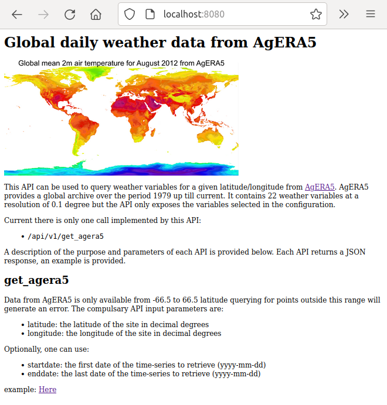
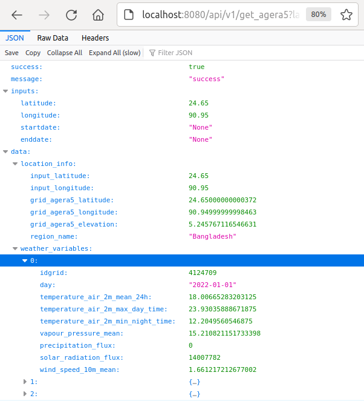

Introduction
============

Since 2021 the `AgERA5`_ dataset is available on the Copernicus Climate Data Store (CDS). AgERA5 provides
daily values of 22 commonly used meteorological variables globally at a 0.1x0.1 degree resolution.
AgERA5 is derived
from the ERA5 reanalysis dataset developed by ECMWF, but is specifically designed for agrometeorological
applications. For example, ERA5 consists of hourly data which is often not convenient for agrometeorological
purposes where daily data is often required. So the AgERA5 product already does the aggregation from
hourly to daily values taking into account that the definition of day-time and night-time is time-zone
dependent. Moreover, many agro-relevant variables have been derived such as daily min/max temperature,
total daily solar radiation, daily precipitation sums, etc. Finally, similar to ERA5, AgERA5 is updated
daily with a delay on realtime of 8 days.

Nevertheless, setting up AgERA5 in a way that is convenient for end users still requires a considerable effort.
For example, the dataset is provided by the CDS as netCDF files but a way to easily access the data is
not available. The CDS provides an interface to query AgERA5 data: the `AgERA5 explorer`_ but the interface
is limited, it is very slow and it only allows to manually download single variables in CSV format.
In this respect, the end-user experience of the `NASA POWER`_ dataset is much better as it provides
a user interface and a convenient web API to query data. The AgERA5tools package has been developed
to alleviate the problem with accessing AgERA5 data. It makes setting up a local mirror of AgERA5 much easier,
time series of meteorological data can be extracted easily and it provides a web API that can be used by
other applications to easily access AgERA5 data.

.. _`AgERA5`: https://cds.climate.copernicus.eu/cdsapp#!/dataset/sis-agrometeorological-indicators
.. _`NASA POWER`: https://power.larc.nasa.gov/
.. _`AgERA5 explorer`: https://cds.climate.copernicus.eu/cdsapp#!/software/app-agriculture-agera5-explorer-data-extractor?tab=app

Setting up AgERA5tools
======================

Creating a python environment
-----------------------------

A python environment has to be created that has all the requirements for AgERA5tools. AgERA5tools was developed using
python 3.8.10 but this is not critical. Older or more recent version of python will most likely work as well. Third party packages required for installing are::

    - Pandas >= 1.5
    - SQLAlchemy >= 1.4
    - PyYAML >= 6.0
    - xarray >= 2022.12.0
    - dask >= 2022.7.7
    - click >= 8.1
    - flask >= 2.2
    - cdsapi >= 0.5.1
    - dotmap >= 1.3
    - netCDF4 >= 1.6
    - requests >= 2.28
    - wsgiserver >= 1.3

Although exact version numbers are provided, this is usually not critical.

Creating a conda environment can be done (installing the Anaconda python environment is not covered here) from the
command prompt with the `conda` command::

    $ conda create --name py38_a5t python=3.8 pandas sqlalchemy pyyaml xarray dask click flask netCDF4 requests

The environment can be activated with::

    $ conda activate py38_a5t

Finally, a few additional packages need to be installed with pip::

    $ pip install cdsapi dotmap wsgiserver

Installing AgERA5tools
----------------------

AgERA5tools can now be installed with::

   $ pip install agera5tools

The `agera5tools` package can now be imported from python::

    $ python
    Python 3.8.10 (default, Nov 14 2022, 12:59:47)
    [GCC 9.4.0] on linux
    Type "help", "copyright", "credits" or "license" for more information.
    >>> import agera5tools
    No config found: Using default AGERA5TOOLS configuration!
    using config from /home/allard/Projects/crucial/agera5tools/agera5tools/agera5tools.yaml
    >>>

Moreover, there should be an `agera5tools` command in your current environment::

    $ agera5tools
    No config found: Using default AGERA5TOOLS configuration!
    using config from /home/allard/Projects/crucial/agera5tools/venv/lib/python3.8/site-packages/agera5tools/agera5tools.yaml
    Usage: agera5tools [OPTIONS] COMMAND [ARGS]...

    Options:
      --help  Show this message and exit.

    Commands:
      build          Builds the AgERA5 database by bulk download from CDS
      check          Checks the completeness of NetCDF files from which the...
      clip           Extracts a portion of agERA5 for the given bounding box...
      dump           Dump AgERA5 data for a given day to CSV, JSON or SQLite
      dump_grid      Dump the agERA5 grid to a CSV, JSON or SQLite DB.
      extract_point  Extracts AgERA5 data for given location and date range.
      init           Initializes AgERA5tools
      mirror         Incrementally updates the AgERA5 database by daily...
      serve          Starts the http server to serve AgERA5 data through HTTP

Since we have not set up `agera5tools`, the package is complaining that a configuration file cannot be found. We will
now initialize agera5tools and create a configuration.

Initializing agera5tools - part I
---------------------------------

First of all, a location needs to be created where agera5tools can store the configuration file, data, logs and
temporary storage. In this setup we assume that this will be under `/data/agera5/`. An SQLite database will then
be created under `/data/agera5/agera5.db`, log files will reside under `/data/agera5/logs/`, NetCDF files
downloaded from the Climate Data Store will go under `/data/agera5/ncfiles` while CSV exports and temporary
files go under `/data/agera5/csv` and `/data/agera5/tmp`.

The first step is to run the `init` command. This command creates a default configuration file in the current
directory. Press enter to abort the init process in order to first modify the configuration file::

    $ agera5tools init
    No config found: Using default AGERA5TOOLS configuration!
    using config from /home/wit015/bin/miniconda3/envs/py38_a5t/lib/python3.8/site-packages/agera5tools/agera5tools.yaml
    Successfully created agera5tools config file at: /data/agera5/agera5tools.yaml

    If this is the first time you run `init` you probably want to inspect/update your configuration
    file first. [y/N]:
    Aborted!

Now we need to inspect the `agera5tools.yaml` file with a text editor. We will go through the section of the
configuration file below.

Adapting the configuration file
-------------------------------

For this guide we will mostly use the default settings which are already defined in the `agera5tools.yaml` file.
It will set up agera5tools for a region including Bangladesh for a single year (2022). This will lead
to a relatively small database file of 1.3 Gb. Be aware that choosing a large region, will very quickly lead to
a large database and in such cases other database solutions should be chosen. Moreover, for large areas agera5tools will require a considerable amount of computer memory because it converts a month of AgERA5 data into a pandas dataframe which must be held in-memory.

Logging
.......

Only the path to the logging directory needs to be set.

.. code:: yaml

    logging:
      # Details for the log. Log levels follow conventions of the python logging framework.
      log_path: /data/agera5/logs
      log_fname: agera5tools.log
      log_level_console: WARNING
      log_level_file: INFO

Region definition
.................

The region of interest is defined by the min/max longitude and latitude in decimal degrees. Moreover a name for
the region should be provided.

.. code:: yaml

    region:
      # This defines the characteristics of the region that you want to set up.
      name: "Bangladesh"
      boundingbox:
        lon_min: 87
        lat_min: 20.5
        lon_max: 93
        lat_max: 27

Temporal range
..............

The temporal range defines the time range for which the database should be retrieved from the CDS.
Most important here is the start_year which should be >= 1979. For a database which will be
updated daily (e.g. a mirror), the end_year should be in the future but for a database with a
fixed time period another end_year can be chosen. For the current example, we only select data
from 1 January 2022 onward by setting `start_year: 2022` and `end_year: 2099`.

.. code:: yaml

    temporal_range:
      # Temporal range defines the time range for which the database should be retrieved from the CDS.
      # Most important here is the start_year which should be >= 1979. For a database which will be
      # updated daily (e.g. a mirror), the end_year should be in the future but for a database with a
      # fixed time period another end_year can be chosen.
      start_year: 2022
      end_year: 2099

Miscellaneous
.............

The most important setting here is the `reference_point`. This point is defined by its latitude/longitude
and is used by agera5tools to query the database for the dates where AgERA5 data is available.
Based on the difference between
the available dates in the database and the current date, agera5tools decides which days should be mirrored
and retrieved from the CDS. Note that the `reference_point` should lie *within the bounding box of the area
of interest* and should be *located on land*.

Some other settings have to do with the search radius (can be left as is) and whether values in Kelvin
should be converted to Celsius. Finally the `agera5_version` has to be set, as of 23 September 2023, the
version "1.0" is deprecated in favour of "1.1".

.. code:: yaml

    misc:
      # Miscellaneous settings:
      #  - agera5_version indicates the version to use. As of 2023-09-23 only v1.1 is available, v1.0 is deprecated
      #  - The reference point defines a point within the boundingbox that will be used by the mirror
      #    procedure to check the available dates in the database. This point should be on land!
      #  - grid_search_radius is the radius within which the nearest grid ID will be searched,
      #    leave as is.
      #  - kelvin_to_celsius indicates if temperature conversion should be done.
      agera5_version: "1.1"
      reference_point:
        lon: 90.00
        lat: 23.97
      grid_search_radius: 0.2
      kelvin_to_celsius: yes

Credentials for the Climate Data Store
......................................

The API credentials for the Climate Data Store can be obtained by registering on the `CDS`_
and retrieving the UID and API key from your login details page on the CDS. Note that the
UID and API Key are *different from the username/password* that you used to register on the CDS.
Moreover, if you are already using the python `cdsapi` package to retrieve data from the CDS,
you probably already have a `.cdsapirc` file in your home folder and you can skip this step.

.. _`CDS`: https://cds.climate.copernicus.eu

.. code:: yaml

    cdsapi:
      # Details for the Copernicus Climate Data Store. Information here will be written into the
      # $HOME/.cdsapirc file, which is used by the python API client for the CDS.
      url: https://cds.climate.copernicus.eu/api/v2
      key: <Your API key here>
      uid: <Your UID here>
      verify: 1

Database settings
.................

The database settings define the data source name to the database and the table name used to
store the AgERA5 data. Note that the DSN should follow the SQLAlchemy database URL naming
convention. The example below uses a local SQLite database which is a serverless database
without security risks.

The `chunk_size` parameter defines the number of records that are written to the database
as one chunk. Increasing this number may increase database performance. Chunked writing
was added because a log message is written after each chunk which allows to keep track of
progress during database writing. The `chunk_size` parameter should be larger than zero.

.. warning::
    The data source name to the database stores the database username/password in plain text.
    This is a potential security risk and for servers that are exposed on the web other
    solutions are required. This could be done by putting agera5tools in a Docker container
    and using `Sealed Secrets`_

.. _`Sealed Secrets`: https://registry.hub.docker.com/r/bitnami/sealed-secrets-controller#!

.. code:: yaml

    database:
      # Details for the database that will be used to store the AgERA5 data.
      # The data source name (dsn) points to the database and should have the form of an
      # SQLAlchemy database URL: https://docs.sqlalchemy.org/en/20/core/engines.html
      # Note that the URL may contain the database password in plain text which is a security
      # risk.
      dsn: sqlite:////data/agera5/agera5.db
      agera5_table_name: weather_grid_agera5
      grid_table_name: grid_agera5
      chunk_size: 10000

Data storage locations
......................

Agera5tools requires several locations on the filesystem for storing netCDF files, log files and
optionally compressed CSV exports that can be used to manually load data into the database.
Keeping the NetCDF files that are downloaded from the CDS is optional, but makes rebuilding the
database faster as no downloads to have be carried out.

.. code:: yaml

    data_storage:
      # Storage path for NetCDF files, CSV files and temporary storage.
      netcdf_path: /data/agera5/ncfiles/
      keep_netcdf: yes
      tmp_path: /data/agera5/tmp
      csv_path: /data/agera5/csv

AgERA5 variable selection
.........................

The YAML configuration below can be used to select which AgERA5 variables must be downloaded
and made available through the web API. By default 7 variables are selected which are used
to run common crop simulation models like WOFOST, LINGRA, DSSAT, etc.

.. code:: yaml

    variables:
      # Select which variables should be downloaded from the CDS
      Temperature_Air_2m_Mean_24h: yes
      Temperature_Air_2m_Mean_Day_Time: no
      Temperature_Air_2m_Mean_Night_Time: no

      ...

      Relative_Humidity_2m_18h: no
      Precipitation_Rain_Duration_Fraction: no
      Precipitation_Solid_Duration_Fraction: no

Initializing agera5tools - Part II
----------------------------------

After modifying the agera5tools configuration file, we need to instruct agera5tools to use our new
configuration file. This is done by setting an environment variable which points to the location of
the configuration file. In a Linux bash shell this is done as:

.. code:: bash

    $ export AGERA5TOOLS_CONFIG=/data/agera5/agera5tools.yaml
    $ agera5tools
    using config from /data/agera5/agera5tools.yaml
    Usage: agera5tools [OPTIONS] COMMAND [ARGS]...

    Options:
      --help  Show this message and exit.

    Commands:
      build          Builds the AgERA5 database by bulk download from CDS
      check          Checks the completeness of NetCDF files from which the...
      clip           Extracts a portion of agERA5 for the given bounding box...
      dump           Dump AgERA5 data for a given day to CSV, JSON or SQLite
      dump_grid      Dump the agERA5 grid to a CSV, JSON or SQLite DB.
      extract_point  Extracts AgERA5 data for given location and date range.
      init           Initializes AgERA5tools
      mirror         Incrementally updates the AgERA5 database by daily...
      serve          Starts the http server to serve AgERA5 data through HTTP

When running the `agera5tools` command, it now stops complaining about a missing configuration file
and it points to the correct file location. Note that on Windows OS, setting an environment variable
should be done as:

.. code:: dos

    $ export AGERA5TOOLS_CONFIG c:\data\agera5\agera5tools.yaml

Now we can finalize the init proces by rerunning the `init` command:

.. code:: bash

    $ agera5tools init
    using config from /data/agera5/agera5tools.yaml

    If this is the first time you run `init` you probably want to abort now and inspect/update your
    configuration file first. Continue? [y/N]: y
    The .cdsapirc file already exists at /home/wit015/.cdsapirc
    Succesfully created tables on DSN=Engine(sqlite:////data/agera5/agera5.db)
    AgERA5tools successfully initialized!.

As you see, agera5tools has checked if a .cdsapirc file exists. In this case it did find one, otherwise it would
have created one. Next, it has created an SQLite database that will be used for storing the AgERA5 data. Note that
for small setups an SQLite database is fine. However, for covering large areas a more capable database server will
be required such as MySQL or PostgreSQL.

Building the database
---------------------

The next step in the agera5tools setup is to build the database. This means that agera5tools will download the
netCDF files from the `CDS`_ for the period, region and variables that you specified in the configuration file.
The data will be exported and loaded into the database specified in the configuration file. The `build` command
was designed for bulk downloading and processing which is done once. Next, the `mirror` command can be used for
incremental updates of the database.

When looking at the `build` command in more detail, it provides to additional options which are `--to_database`
and `--to_csv`:

.. code:: bash

    $ agera5tools build --help
    using config from /data/agera5/agera5tools.yaml
    Usage: agera5tools build [OPTIONS]

      Builds the AgERA5 database by bulk download from CDS

    Options:
      -d, --to_database  Load AgERA5 data into the database
      -c, --to_csv       Write AgERA5 data to compressed CSV files.
      --help             Show this message and exit.

Without those options, the build command only downloads NetCDF files but does not load anything in the database
or export to CSV. It will therefore issue a warning that no output will be written.

The background of implementing these options is that the database loading of agera5tools relies on the `to_sql()`
functionality of `pandas` which is a relatively slow method. For small setups this is fine and you can directly
load by specifying `--to_database`. However, for setups over large regions, this can be very slow and instead
you want to export to CSV files. Next you can load the database by using dedicated loading tools such as
`pgloader`_ for postgress, `sqlloader`_ for ORACLE and MySQL `LOAD DATA` statements which take the CSV files as
input.

For the current example, we will run `build` and directly write data into the SQLite database:

.. code:: bash

    $ agera5tools build --to_database
    using config from /data/agera5/agera5tools.yaml
    Export to database: True
    Export to CSV: False

Note that the downloading and building of the database will not produce any output on the console. Instead
output is reported in the log file and one should monitor the log file in order to know the progress.
An example of the output produced in the log file is here::

    2023-01-10 15:14:24,105 [INFO] agera5tools.build: Starting AgERA5 download for 2021-11
    2023-01-10 15:14:24,119 [INFO] agera5tools.build: Skipping download, NetCDF files already exist.
    2023-01-10 15:14:24,119 [INFO] agera5tools.build: Starting AgERA5 download for 2021-12
    2023-01-10 15:14:24,143 [INFO] agera5tools.build: Skipping download, NetCDF files already exist.
    2023-01-10 15:14:31,620 [INFO] agera5tools.build: Written AgERA5 data for 2020-01 to database.
    2023-01-10 15:14:40,532 [INFO] agera5tools.build: Written AgERA5 data for 2020-02 to database.
    2023-01-10 15:14:50,363 [INFO] agera5tools.build: Written AgERA5 data for 2020-03 to database.
    2023-01-10 15:15:01,190 [INFO] agera5tools.build: Written AgERA5 data for 2020-04 to database.
    2023-01-10 15:15:11,829 [INFO] agera5tools.build: Written AgERA5 data for 2020-05 to database.
    2023-01-10 15:15:22,660 [INFO] agera5tools.build: Written AgERA5 data for 2020-06 to database.

Finally, the `build` command will complete:

.. code:: bash

    $ agera5tools build --to_database
    using config from /data/agera5/agera5tools.yaml
    Export to database: True
    Export to CSV: False
    Done building database, use the `mirror` command to keep the DB up to date

.. _`pgloader`: https://pgloader.io/
.. _`sqlloader`: https://docs.oracle.com/en/database/oracle/oracle-database/12.2/sutil/oracle-sql-loader-commands.html

Keeping AgERA5 up to date: mirroring
------------------------------------

The AgERA5 dataset receives daily updates and thus a new set of NetCDF files is available on the CDS around 17:00 UTC.
To keep your local copy of AgERA5 in sync with the AgERA5 data on the CDS, agera5tools provides a `mirror` command. This
`mirror` command will query the local AgERA5 database for the available days and compares it to the days that should be
available. The latter is computed as the 1 :sup:`st` of January of the start year in the configuration, up till 8
days before today.

The `mirror` command provides only a single option `--to_csv` which allows to write the data to a compressed CSV file.
The `mirror` command will always update the database because mirror assumes that the amount of data to load is limited
(only a few days) for which performance is sufficient.

.. code:: bash

    $ agera5tools mirror --help
    using config from /data/agera5/agera5tools.yaml
    Usage: agera5tools mirror [OPTIONS]

      Incrementally updates the AgERA5 database by daily downloads from the CDS

    Options:
      -c, --to_csv  Write AgERA5 data to compressed CSV files.
      --help        Show this message and exit.

When running the `mirror` command on a database with a few days missing, it will update the database and report
on the number of days missing. Detailed information can be found in the log files.

.. code:: bash

    $ agera5tools mirror
    using config from /data/agera5/agera5tools.yaml
    Mirror found the following:
     - Days found for mirroring: 2023-01-04, 2023-01-05
     - Days successfully updated: 2023-01-04, 2023-01-05

It may occur that days are not yet be available on the CDS. In that case `mirror` is not  ble to download the data and it will not be able to update the database. Unfortunately, the python CDS API is such that it will issue a large number of error messages to the screen which are hard to intercept::

    [ERROR] - Failed downloading Temperature_Air_2m_Max_Day_Time - 2023-01-19
    Traceback (most recent call last):
      File "/home/wit015/bin/miniconda3/envs/py38_a5t/lib/python3.8/site-packages/agera5tools/mirror.py", line 86, in download_one_day
        c.retrieve('sis-agrometeorological-indicators', cds_query, download_fname)
      File "/home/wit015/bin/miniconda3/envs/py38_a5t/lib/python3.8/site-packages/cdsapi/api.py", line 348, in retrieve
        result = self._api("%s/resources/%s" % (self.url, name), request, "POST")
      File "/home/wit015/bin/miniconda3/envs/py38_a5t/lib/python3.8/site-packages/cdsapi/api.py", line 506, in _api
        raise Exception(
    Exception: the request you have submitted is not valid. There is no data matching your request. Check that you have specified the correct fields and values..

Nevertheless, the last lines summarize what `mirror` was able to do::

    Mirror found the following:
     - Days found for mirroring: 2023-01-19
     - Days successfully updated: N/A
     - Days failed to update: 2023-01-19, see log for details

Other agera5tools commands
==========================

The agera5tools package provides several other commands that can be useful when working with AgERA5. These
commands operate on the NetCDF files directly and are therefore only useful when the NetCDF files are kept.

Check
-----

The `check` command can be used to check if the collection of NetCDF files obtained from the CDS is
complete. For example, running `agera5tools check` on a database that was not updated for a
day will provide the list of missing netCDF files:

.. code:: bash

    $ agera5tools check
    using config from /data/agera5/agera5tools.yaml
    Found 7 missing NetCDF files under /data/agera5/ncfiles:
     - /data/agera5/ncfiles/2022/Temperature-Air-2m-Mean-24h/Temperature-Air-2m-Mean-24h_C3S-glob-agric_AgERA5_20221231_final-v1.0.nc
     - /data/agera5/ncfiles/2022/Temperature-Air-2m-Max-Day-Time/Temperature-Air-2m-Max-Day-Time_C3S-glob-agric_AgERA5_20221231_final-v1.0.nc
     - /data/agera5/ncfiles/2022/Temperature-Air-2m-Min-Night-Time/Temperature-Air-2m-Min-Night-Time_C3S-glob-agric_AgERA5_20221231_final-v1.0.nc
     - /data/agera5/ncfiles/2022/Vapour-Pressure-Mean/Vapour-Pressure-Mean_C3S-glob-agric_AgERA5_20221231_final-v1.0.nc
     - /data/agera5/ncfiles/2022/Precipitation-Flux/Precipitation-Flux_C3S-glob-agric_AgERA5_20221231_final-v1.0.nc
     - /data/agera5/ncfiles/2022/Solar-Radiation-Flux/Solar-Radiation-Flux_C3S-glob-agric_AgERA5_20221231_final-v1.0.nc
     - /data/agera5/ncfiles/2022/Wind-Speed-10m-Mean/Wind-Speed-10m-Mean_C3S-glob-agric_AgERA5_20221231_final-v1.0.nc

Clip
----

The `clip` command can be used to clip a rectangular area out of the region for which agera5tools is
set up, for a given day. Note that the bounding box of the region for clipping should lie within the
bounding box of the agera5tools setup. The command creates a new NetCDF file which contains all the
AgERA5 variables in one file:

.. code:: bash

    $ agera5tools clip -o /tmp/a5t/ --bbox 88 90 25 27 2022-07-03
    using config from /data/agera5/agera5tools.yaml
    Written results to: /tmp/a5t/agera5_clipped_2022-07-03.nc

    $ ncdump -h /tmp/a5t/agera5_clipped_2022-07-03.nc
    netcdf agera5_clipped_2022-07-03 {
    dimensions:
        time = 1 ;
        lon = 20 ;
        lat = 20 ;
    variables:
        int64 time(time) ;
            time:standard_name = "time" ;
            time:long_name = "time" ;
            time:axis = "T" ;
            time:units = "days since 1900-01-01" ;
            time:calendar = "proleptic_gregorian" ;
        double lon(lon) ;
            lon:_FillValue = NaN ;
            lon:standard_name = "longitude" ;
            lon:long_name = "longitude" ;
            lon:units = "degrees_east" ;
            lon:axis = "X" ;
        double lat(lat) ;
            lat:_FillValue = NaN ;
            lat:standard_name = "latitude" ;
            lat:long_name = "latitude" ;
            lat:units = "degrees_north" ;
            lat:axis = "Y" ;
        float Precipitation_Flux(time, lat, lon) ;
            Precipitation_Flux:_FillValue = -9999.f ;
            Precipitation_Flux:units = "mm d-1" ;
            Precipitation_Flux:long_name = "Total precipitation (00-00LT)" ;
            Precipitation_Flux:temporal_aggregation = "Sum 00-00LT" ;
            Precipitation_Flux:missing_value = -9999.f ;
        float Solar_Radiation_Flux(time, lat, lon) ;
            Solar_Radiation_Flux:_FillValue = -9999.f ;
            Solar_Radiation_Flux:units = "J m-2 d-1" ;
            Solar_Radiation_Flux:long_name = "Surface solar radiation downwards (00-00LT)" ;
            Solar_Radiation_Flux:temporal_aggregation = "Sum 00-00LT" ;
            Solar_Radiation_Flux:missing_value = -9999.f ;
        float Temperature_Air_2m_Max_Day_Time(time, lat, lon) ;
            Temperature_Air_2m_Max_Day_Time:_FillValue = -9999.f ;
            Temperature_Air_2m_Max_Day_Time:units = "K" ;
            Temperature_Air_2m_Max_Day_Time:long_name = "Maximum temperature at 2 meter (06-18LT)" ;
            Temperature_Air_2m_Max_Day_Time:temporal_aggregation = "Max 06-18LT" ;
            Temperature_Air_2m_Max_Day_Time:missing_value = -9999.f ;
        float Temperature_Air_2m_Mean_24h(time, lat, lon) ;
            Temperature_Air_2m_Mean_24h:_FillValue = -9999.f ;
            Temperature_Air_2m_Mean_24h:units = "K" ;
            Temperature_Air_2m_Mean_24h:long_name = "2 meter air temperature (00-00LT)" ;
            Temperature_Air_2m_Mean_24h:temporal_aggregation = "Mean 00-00LT" ;
            Temperature_Air_2m_Mean_24h:missing_value = -9999.f ;
        float Temperature_Air_2m_Min_Night_Time(time, lat, lon) ;
            Temperature_Air_2m_Min_Night_Time:_FillValue = -9999.f ;
            Temperature_Air_2m_Min_Night_Time:units = "K" ;
            Temperature_Air_2m_Min_Night_Time:long_name = "Minimum temperature at 2 meter (18-06LT)" ;
            Temperature_Air_2m_Min_Night_Time:temporal_aggregation = "Min 18-06LT" ;
            Temperature_Air_2m_Min_Night_Time:missing_value = -9999.f ;
        float Vapour_Pressure_Mean(time, lat, lon) ;
            Vapour_Pressure_Mean:_FillValue = -9999.f ;
            Vapour_Pressure_Mean:units = "hPa" ;
            Vapour_Pressure_Mean:long_name = "Vapour pressure (00-00LT)" ;
            Vapour_Pressure_Mean:temporal_aggregation = "Mean 00-00LT" ;
            Vapour_Pressure_Mean:missing_value = -9999.f ;
        float Wind_Speed_10m_Mean(time, lat, lon) ;
            Wind_Speed_10m_Mean:_FillValue = -9999.f ;
            Wind_Speed_10m_Mean:units = "m s-1" ;
            Wind_Speed_10m_Mean:long_name = "10 metre wind component (00-00LT)" ;
            Wind_Speed_10m_Mean:temporal_aggregation = "Mean 00-00LT" ;
            Wind_Speed_10m_Mean:missing_value = -9999.f ;

    // global attributes:
            :Conventions = "CF-1.7" ;
    }

Dump
----

The `dump` command can be used to take the contents of the NetCDF files of AgERA5 for a given day,
and dump the results to a tabular format which can be either CSV, JSON or an SQLite database
depending on the suffix of the output filename (.csv, .json or .db3). If no output filename is
provided, the dump command will send its output to standard output in CSV format.

The example below shows how to dump to JSON for a small region within Bangladesh:

.. code:: bash

    $ agera5tools dump -o /tmp/a5t/agera_2022-07-03.json --bbox 88 90 25 27 2022-07-03
    using config from /data/agera5/agera5tools.yaml
    Written JSON output to: /tmp/a5t/agera_2022-07-03.json

    $ cat /tmp/a5t/agera_2022-07-03.json | jq
    [
      {
        "day": 1656806400000,
        "lon": 88.15,
        "lat": 26.95,
        "precipitation_flux": 3.5599999428,
        "solar_radiation_flux": 16385375,
        "temperature_air_2m_max_day_time": 24.7488708496,
        "temperature_air_2m_mean_24h": 21.5311584473,
        "temperature_air_2m_min_night_time": 18.8098754883,
        "vapour_pressure_mean": 22.9674816132,
        "wind_speed_10m_mean": 1.1026197672
      },
    ...
      {
        "day": 1656806400000,
        "lon": 90.05,
        "lat": 25.05,
        "precipitation_flux": 4.4800000191,
        "solar_radiation_flux": 18370952,
        "temperature_air_2m_max_day_time": 32.2112121582,
        "temperature_air_2m_mean_24h": 28.7552490234,
        "temperature_air_2m_min_night_time": 26.2648620605,
        "vapour_pressure_mean": 32.9158477783,
        "wind_speed_10m_mean": 2.8463871479
      }
    ]

Extract_point
-------------

The `extract_point` command can be used to extract the time-series of AgERA5 data for a given location
specified by its latitude and longitude, moreover the time-series can be limited by a start date and an
end date. The output will be written in a tabular format which can be either CSV, JSON or an SQLite database
depending on the suffix of the output filename (.csv, .json or .db3). If no output filename is
provided, the `extract_point` command will send its output to standard output in CSV format.

.. code:: bash

    $ agera5tools extract_point 90 24 2022-06-01 2022-06-05
    using config from /data/agera5/agera5tools.yaml
    day,precipitation_flux,solar_radiation_flux,temperature_air_2m_max_day_time,temperature_air_2m_mean_24h,temperature_air_2m_min_night_time,vapour_pressure_mean,wind_speed_10m_mean
    2022-06-01,   6.03,19547780,  31.98,  28.38,  25.76,  32.43,   2.59
    2022-06-02,  44.67,9140519,  30.06,  28.03,  25.56,  32.08,   2.04
    2022-06-03,   2.93,12673785,  31.15,  28.59,  26.02,  32.72,   3.41
    2022-06-04,   2.16,16276887,  32.50,  28.10,  26.70,  32.77,   3.69
    2022-06-05,   3.09,18650926,  32.79,  29.38,  26.75,  34.05,   3.82

Dump_grid
---------

The `dump_grid` command can be used to dump the grid definition of AgERA5 to a tabular format.
It has little use outside the initial set up of the AgERA5 database, but is added for convenience.
For set ups for large regions it is often more convenient to dump the grid to CSV and load it
with a dedicated tool. Similar to `dump`  `extract_point`, the `dump_grid` command can write to
CSV, JSON or SQLite and will write to stdout if no output is given:

.. code:: bash

    $ agera5tools dump_grid | head
    using config from /data/agera5/agera5tools.yaml
    ll_latitude,ll_longitude,idgrid_era5,elevation,land_fraction,latitude,longitude
      83.90, -40.30,6258197,  -4.62,   0.00,  83.95, -40.25
      83.90, -40.20,6258198,  -4.62,   0.00,  83.95, -40.15
      83.90, -40.10,6258199,  -4.62,   0.00,  83.95, -40.05
      83.90, -40.00,6258200,   7.40,   0.00,  83.95, -39.95
      83.90, -39.90,6258201,   7.40,   0.00,  83.95, -39.85
      83.90, -39.80,6258202,   7.40,   0.00,  83.95, -39.75
      83.90, -39.70,6258203,  19.50,   0.00,  83.95, -39.65
      83.90, -39.60,6258204,  19.50,   0.00,  83.95, -39.55

Serving AgERA5 data through an HTTP API
=======================================

Creating a local mirror of the AgERA5 database only starts to be useful when the data is easily
accessible for applications. For this purpose, agera5tools can serve the AgERA5 data in the
database through a web API using the HTTP protocol. Time-series of AgERA5 data can be requested
through a parameterized URL which provides the location for which the data is requested as well
as an optional start and end date. Through this approach AgERA5 data can be made available for
application running locally or through a webserver on the local network.

For serving data on a local network agera5tools provides the `serve` command which has a single
option `--port=<number>`. By default the port number is 8080, but the port number can be changed
to solve conflicts with existing web applications or by allowing multiple agera5tools instances
to run simultaneously:

.. code:: bash

    $ agera5tools serve
    using config from /data/agera5/agera5tools.yaml
    Started serving AgERA5 data on http://localhost:8080

When a web browser is pointed to `http://localhost:8080`, the browser will show a short help text
as show in the image below.

Moreover, the help page contains an example URL at the bottom below
that can be used to query data from the database and demonstrate the response, as shown below.

finally, take note of the warning below on using `agera5tools serve`.

.. warning::
    The `serve` capabilities of agera5tools are based on the `Flask web framework`_ combined with a
    `WSGI server`_. This combination is an effective and lightweight approach to serving data on a
    local machine or a local network. This approach is not guaranteed to be safe and robust enough
    to serve AgERA5 on a web address that is exposed to the outside world. For such a task you
    will probably need a set up that combines a secure high performance web server (such as NGINX)
    that works with a WSGI server on the background (the one that can serve Flask applications).
    Ideally this could be done using docker for which a nice tutorial and base docker images are
    available `here`_.

.. _`Flask web framework`: https://flask.palletsprojects.com/en/2.2.x/
.. _`WSGI server`: https://pypi.org/project/WSGIserver/
.. _`here`: https://github.com/tiangolo/uwsgi-nginx-flask-docker

Using agera5tools directly from python
======================================

The shell commands described above can also be used from python directly by importing the agera5tools package.
Their working is nearly identical as the shell commands. The major difference is that the python functions
return either datasets (clip) or dataframes (extract_point, dump, dump_grid). An example for the `clip` function::

    In [1]: import datetime as dt
       ...: import agera5tools
       ...: from agera5tools.util import BoundingBox
       ...: day = dt.date(2018,1,1)
       ...: bbox = BoundingBox(lon_min=87, lon_max=90, lat_min=24, lat_max=27)
       ...: ds = agera5tools.clip(day, bbox)
       ...:

    In [2]: ds
    Out[2]:
    <xarray.Dataset>
    Dimensions:                            (time: 1, lon: 30, lat: 30)
    Coordinates:
      * time                               (time) datetime64[ns] 2018-01-01
      * lon                                (lon) float64 87.1 87.2 ... 89.9 90.0
      * lat                                (lat) float64 26.9 26.8 ... 24.1 24.0
    Data variables:
        Precipitation_Flux                 (time, lat, lon) float32 dask.array<chunksize=(1, 30, 30), meta=np.ndarray>
        Solar_Radiation_Flux               (time, lat, lon) float32 dask.array<chunksize=(1, 30, 30), meta=np.ndarray>
        Temperature_Air_2m_Max_Day_Time    (time, lat, lon) float32 dask.array<chunksize=(1, 30, 30), meta=np.ndarray>
        Temperature_Air_2m_Mean_24h        (time, lat, lon) float32 dask.array<chunksize=(1, 30, 30), meta=np.ndarray>
        Temperature_Air_2m_Min_Night_Time  (time, lat, lon) float32 dask.array<chunksize=(1, 30, 30), meta=np.ndarray>
        Vapour_Pressure_Mean               (time, lat, lon) float32 dask.array<chunksize=(1, 30, 30), meta=np.ndarray>
        Wind_Speed_10m_Mean                (time, lat, lon) float32 dask.array<chunksize=(1, 30, 30), meta=np.ndarray>
    Attributes:
        CDI:          Climate Data Interface version 1.9.2 (http://mpimet.mpg.de/...
        history:      Fri Mar 12 15:04:43 2021: cdo splitday /archive/ESG/wit015/...
        Conventions:  CF-1.7
        CDO:          Climate Data Operators version 1.9.2 (http://mpimet.mpg.de/...

It works in a very similar way for the `extract_point` function::

    In[6]: from agera5tools.util import Point
    In[7]: pnt = Point(latitude=26, longitude=89)
    In[8]: df = agera5tools.extract_point(pnt, startday=dt.date(2018, 1, 1), endday=dt.date(2018, 1, 31)),
    In [7]: df.head(5)
    Out[7]:
              day  precipitation_flux  solar_radiation_flux  ...  temperature_air_2m_min_night_time  vapour_pressure_mean  wind_speed_10m_mean
    0  2018-01-01                0.31              13282992  ...                          12.156799             11.809731             1.317589
    1  2018-01-02                1.91              13646220  ...                          12.342041             11.711860             1.416075
    2  2018-01-03                0.14              14817991  ...                          11.064514             11.198871             1.524268
    3  2018-01-04                0.03              14131904  ...                          10.861877             11.413278             1.566405
    4  2018-01-05                0.07              14315206  ...                          12.292969             10.984181             1.597181

    [5 rows x 8 columns]

Note that extracting point data for a long timeseries can be time-consuming because all netCDF files have to be opened, decompressed and the point extracted.

Using agera5tools with PCSE models
==================================

AgERA5tools was designed with crop models running in `PCSE`_ in mind, so you directly use output from the `agera5tools serve` into your model running in PCSE. Note that you do need at least the set of weather variables in the default configuration file, otherwise the WeatherDataProvider will complain about missing variables. Moreover, you need to have PCSE installed in your python environment::

    In [1]: import agera5tools
    using config from /data/agera5/agera5tools.yaml

    In [2]: from agera5tools.wdp import AgERA5WeatherDataProvider

    In [3]: wdp = AgERA5WeatherDataProvider(longitude=88, latitude=25)

    In [4]: print(wdp)
    Weather data provided by: AgERA5WeatherDataProvider
    --------Description---------
    Weather data from AgERA5 for Bangladesh
    ----Site characteristics----
    Elevation:   35.9
    Latitude:  25.000
    Longitude: 88.000
    Data available for 2022-01-01 - 2023-01-25
    Number of missing days: 0

This assumes that `agera5tools serve` is running under `http://localhost:8080`, otherwise you need to
specify the hostname and port number with `AgERA5WeatherDataProvider(longitude=88, latitude=25, hostname=<host>, port=<num>)`

.. _`PCSE`: https://pcse.readthedocs.io

A note on efficient database loading
====================================

Using ``agera5tools build`` for large areas and/or long time-series can be notoriously inefficient because of the large number of records that have to be loaded into the database. In such cases it is more efficient to dump data to CSV first and load the CSV files with dedicated loader tools. Moreover, for efficient loading it is best to disable any keys and lock the table for exclusive write mode, which is not done by agera5tools. Below I show an example of how efficient loading can be done for MySQL (or MariaDB) and PostgreSQL.

Bulk loading AgERA5 with MySQL
------------------------------

For this tutorial I will be using some tricks and constructs that work well in a linux terminal environment. It may work similarly in a windows command prompt but it wasn't tested and your mileage may vary. If problems arise on windows, a solution is to install `cygwin <https://www.cygwin.com/>`_ and use the MySQL client from cygwin. Otherwise the Windows Subsystem for Linux (`WSL <https://learn.microsoft.com/en-us/windows/wsl/>`_) is an alternative. Furthermore, I assume that MySQL has been set up properly and that there is a `.my.cnf` file in your home folder that provides the username/password and default schema for automatically logging you onto the database. So typing `mysql` on the command prompt should bring you to the database::

    $ mysql
    Reading table information for completion of table and column names
    You can turn off this feature to get a quicker startup with -A

    Welcome to the MySQL monitor.  Commands end with ; or \g.
    Your MySQL connection id is 37
    Server version: 5.7.41-0ubuntu0.18.04.1 (Ubuntu)

    Copyright (c) 2000, 2023, Oracle and/or its affiliates.

    Oracle is a registered trademark of Oracle Corporation and/or its
    affiliates. Other names may be trademarks of their respective
    owners.

    Type 'help;' or '\h' for help. Type '\c' to clear the current input statement.

    mysql>

If the table for holding AgERA5 data does not yet exist, you need to create it:

.. code:: sql

    mysql> CREATE TABLE weather_grid_agera5 (
        -> idgrid INTEGER NOT NULL,
        -> day DATE NOT NULL,
        -> temperature_air_2m_mean_24h FLOAT,
        -> temperature_air_2m_max_day_time FLOAT,
        -> temperature_air_2m_min_night_time FLOAT,
        -> vapour_pressure_mean FLOAT,
        -> precipitation_flux FLOAT,
        -> solar_radiation_flux FLOAT,
        -> wind_speed_10m_mean FLOAT,
        -> PRIMARY KEY (idgrid, day)
        -> );
    Query OK, 0 rows affected (0.26 sec)

    mysql> desc weather_grid_agera5;
    +-----------------------------------+---------+------+-----+---------+-------+
    | Field                             | Type    | Null | Key | Default | Extra |
    +-----------------------------------+---------+------+-----+---------+-------+
    | idgrid                            | int(11) | NO   | PRI | NULL    |       |
    | day                               | date    | NO   | PRI | NULL    |       |
    | temperature_air_2m_mean_24h       | float   | YES  |     | NULL    |       |
    | temperature_air_2m_max_day_time   | float   | YES  |     | NULL    |       |
    | temperature_air_2m_min_night_time | float   | YES  |     | NULL    |       |
    | vapour_pressure_mean              | float   | YES  |     | NULL    |       |
    | precipitation_flux                | float   | YES  |     | NULL    |       |
    | solar_radiation_flux              | float   | YES  |     | NULL    |       |
    | wind_speed_10m_mean               | float   | YES  |     | NULL    |       |
    +-----------------------------------+---------+------+-----+---------+-------+
    9 rows in set (0.00 sec)

Next, we will need the MySQL `LOAD DATA` functionality to load the CSV data efficiently. For doing so we need to create a script that uses `LOAD DATA` to import the CSV file into the right table. For doing so, we need to have a look at the CSV file first in order to determine the order with which the columns are written in the CSV. The default behaviour is to write them in alphabetical order, except for the grid ID which will be the last column. Because the CSV files are compressed we decompress them with `gunzip -c` but use `head` to only look at the first 10 lines:

.. code:: bash

    $ gunzip -c weather_grid_agera5_2022-01.csv.gz | head
    day,precipitation_flux,solar_radiation_flux,temperature_air_2m_max_day_time,temperature_air_2m_mean_24h,temperature_air_2m_min_night_time,vapour_pressure_mean,wind_speed_10m_mean,idgrid
    2022-01-01,-0.0,13162135.0,292.19467,287.67047,284.1365,11.893626,1.4917772,4207471
    2022-01-02,0.0,14147829.0,293.13916,287.74905,283.92963,11.357639,1.4644603,4207471
    2022-01-03,0.0,14122248.0,292.5527,287.527,283.97925,11.133619,1.3984656,4207471
    2022-01-04,0.0,14469930.0,292.50192,286.96817,283.54135,11.348025,1.5083425,4207471
    2022-01-05,0.0,13900673.0,293.0584,287.81125,284.21835,11.7578745,1.5004104,4207471
    2022-01-06,0.65,12647058.0,293.09354,288.46628,284.49408,12.955705,1.4924479,4207471
    2022-01-07,0.85,10431268.0,293.1321,289.32684,286.35342,13.785025,1.3877448,4207471
    2022-01-08,0.07,13741905.0,294.67032,289.89453,285.54935,14.013409,1.3313966,4207471
    2022-01-09,0.25,12168522.0,294.0305,290.2176,286.22925,14.745159,1.4008508,4207471

Here we can see that the column names in the CSV file are indeed in alphabetical order and the `idgrid` column is the last column. We have to take this into account when inserting columns in the CSV file to columns in the database.

As we know the order of the columns we can now define the SQL query to load the data into the table. Most of the commands in the query below are easy to understand with some help of the `MySQL manual`_. The only element that requires explanation is that we are not reading from a CSV file directly, but instead we read from ``/dev/stdin``. Remember that `agera5tools` writes compressed CSV files using gzip. So reading from a CSV file would require us to first decompress the file. However, the `gunzip` command can write to ``/dev/stdin`` with the `-c` option. By using this approach we can unzip the CSV files on-the-fly, write the output to  ``/dev/stdin`` and let MySQL read it from there. This has an additional advantage that the loader file is reusable and we do not need to edit it to change the CSV filename when loading another file.

We need to write the SQL query to a text file `load.sql` and write it in the same directory where the CSV files are stored, in this case ``/data/agera5/csv/``

.. _`MySQL manual`: https://dev.mysql.com/doc/refman/5.7/en/load-data.html

.. code:: sql

    LOCK TABLES weather_grid_agera5 WRITE;
    ALTER TABLE weather_grid_agera5 DISABLE KEYS;

    LOAD DATA LOCAL INFILE '/dev/stdin'
    INTO TABLE weather_grid_agera5
    FIELDS TERMINATED BY ',' OPTIONALLY ENCLOSED BY '"'
    IGNORE 1 LINES
    (@col1,@col2,@col3,@col4,@col5,@col6,@col7,@col8,@col9)
    SET
       day = str_to_date(@col1,'%Y-%m-%d'),
       precipitation_flux = @col2,
       solar_radiation_flux = @col3,
       temperature_air_2m_mean_24h = @col4,
       temperature_air_2m_max_day_time = @col5,
       temperature_air_2m_min_night_time = @col6,
       vapour_pressure_mean = @col7,
       wind_speed_10m_mean = @col8,
       idgrid = @col9
    ;
    ALTER TABLE weather_grid_agera5 ENABLE KEYS;
    UNLOCK TABLES;

The final step is now to start the actual loading process in MySQL. For this we use the `gunzip` command to decompress the CSV file, pipe the output from gunzip to the MySQL client program while instructing MySQL client to read the LOAD DATA instructions with ``mysql -e "source /data/agera5/csv/load.sql"``. One additional flag is sometimes required ``--local-infile`` which instructs MySQL to allow loading data from local clients (which is a security risk). The complete instruction for loading 1 month of AgERA5 data becomes:

.. code:: bash

    $ gunzip -c weather_grid_agera5_2022-01.csv.gz | mysql --local-infile -e  "source /data/agera5/csv/load.sql"

We can now check if the number of records in the database corresponds with the number of lines in the CSV file. The number of lines in the CSV files is::

    $ gunzip -c weather_grid_agera5_2022-01.csv.gz | wc -l
    103076

While the number of records in the database table is::

    $ mysql
    Reading table information for completion of table and column names
    You can turn off this feature to get a quicker startup with -A

    Welcome to the MySQL monitor.  Commands end with ; or \g.
    Your MySQL connection id is 52
    Server version: 5.7.41-0ubuntu0.18.04.1 (Ubuntu)

    Copyright (c) 2000, 2023, Oracle and/or its affiliates.

    Oracle is a registered trademark of Oracle Corporation and/or its
    affiliates. Other names may be trademarks of their respective
    owners.

    Type 'help;' or '\h' for help. Type '\c' to clear the current input statement.

    mysql> select count(*) from weather_grid_agera5;
    +----------+
    | count(*) |
    +----------+
    |   103075 |
    +----------+
    1 row in set (0.03 sec)

As you can see we are missing 1 record which is exactly the header line in the CSV file that we skipped when loading data from it.

Bulk loading AgERA5 with PostgreSQL
-----------------------------------

For loading agERA5 data into PostgreSQL we can use a dedicated loader tool: `pgloader <https://pgloader.readthedocs.io>`_. I assume pgloader is intalled in your environmental and I also assume that there is a properly configured PosgreSQL database. Moreover we can log on to the right schema with the ``psql`` commandline tool. So first we log on to the database and create the output table with the following SQL:

.. code:: sql

    CREATE TABLE weather_grid_agera5 (
            -> idgrid INTEGER NOT NULL,
            -> day DATE NOT NULL,
            -> temperature_air_2m_mean_24h FLOAT,
            -> temperature_air_2m_max_day_time FLOAT,
            -> temperature_air_2m_min_night_time FLOAT,
            -> vapour_pressure_mean FLOAT,
            -> precipitation_flux FLOAT,
            -> solar_radiation_flux FLOAT,
            -> wind_speed_10m_mean FLOAT
            -> );

Note that ``agera5tools init`` will automatically create the output table for you, but for the example we create it manually. In this case we also leave out the primary key definition as PostgreSQL has no option to disable indexes so it is better to create the primary key after loading all data. So after starting ``psql`` we create the table:

.. code:: bash

    $ psql -U <username> -W <password> -h <hostname> <databasename>
    psql (12.13 (Ubuntu 12.13-1.pgdg18.04+1))
    SSL connection (protocol: TLSv1.2, cipher: ECDHE-RSA-AES256-GCM-SHA384, bits: 256, compression: off)
    Type "help" for help.

    agera5db=> CREATE TABLE weather_grid_agera5 (
    agera5db(>     idgrid INTEGER NOT NULL,
    agera5db(>     day DATE NOT NULL,
    agera5db(>     temperature_air_2m_mean_24h FLOAT,
    agera5db(>     temperature_air_2m_max_day_time FLOAT,
    agera5db(>     temperature_air_2m_min_night_time FLOAT,
    agera5db(>     vapour_pressure_mean FLOAT,
    agera5db(>     precipitation_flux FLOAT,
    agera5db(>     solar_radiation_flux FLOAT,
    agera5db(>     wind_speed_10m_mean FLOAT
    agera5db(>     );
    CREATE TABLE
    agera5db=>

After creating the table for holding the agERA5 data, we can now write the control file that `pgloader` requires to load the data. They syntax is somewhat similar to the MySQL ``LOAD DATA`` statement but not compatible:

.. code:: sql

    LOAD CSV
       FROM STDIN
            HAVING FIELDS
            (
               day [date format 'YYYY-MM-DD'],
               precipitation_flux,
               solar_radiation_flux,
               temperature_air_2m_mean_24h,
               temperature_air_2m_max_day_time,
               temperature_air_2m_min_night_time,
               vapour_pressure_mean,
               wind_speed_10m_mean,
               idgrid
            )
       INTO postgresql://<user>:<passwd>@<hostname>/<dbname>?sslmode=require
           TARGET TABLE weather_grid_agera5
           TARGET COLUMNS
               (
               idgrid, day,
               precipitation_flux,
               solar_radiation_flux,
               temperature_air_2m_mean_24h,
               temperature_air_2m_max_day_time,
               temperature_air_2m_min_night_time,
               vapour_pressure_mean,
               wind_speed_10m_mean
               )
       WITH skip header = 1,
            fields terminated by ','
       SET work_mem to '32 MB', maintenance_work_mem to '64 MB';

Note that, similar to MySQL, the order of the column names in the "HAVING FIELDS" clause is critical for reading and inserting the data in the correct columns in the database table. Also with `pgloader` we can read directly from standard input (here: ``STDIN``) which avoids having to write decompressed CSV files. In my specific case, the database connection string needed an extra parameter ``sslmode=require``, this may depend on your database setup.

Finally, we can start loading the data with the `pgloader` tool. I assume that we start pgloader from `/data/agera5/csv` which also contains the control file `load_agera5.ctl`. Moreover, we assign the current directory as work directory with ``-D $PWD`` which puts the pgloader log files in the current directory. The full command than becomes:

.. code:: bash

    $ gunzip -c weather_grid_agera5_2022-01.csv.gz | \
      pgloader -D $PWD --logfile load_agera5.log --summary load_agera5.summary \
               --no-ssl-cert-verification load_agera5.ctl
    2023-01-31T13:54:22.039000Z LOG pgloader version "3.6.7~devel"
    2023-01-31T13:54:29.243000Z LOG report summary reset

We can now look at the summary to see if loading was successful:

.. code:: bash

    $ cat load_agera5.summary
                        table name     errors       rows      bytes      total time
    ------------------------------  ---------  ---------  ---------  --------------
                             fetch          0          0                     0.009s
                       before load          0          1                     0.041s
    ------------------------------  ---------  ---------  ---------  --------------
    "agera5db"."weather_grid_agera5"        0     103075     9.0 MB          6.945s
    ------------------------------  ---------  ---------  ---------  --------------
                   Files Processed          0          1                     0.021s
           COPY Threads Completion          0          2                     6.945s
    ------------------------------  ---------  ---------  ---------  --------------
                 Total import time          ✓     103075     9.0 MB          6.966s

Based on the summary results, we can see that loading was successful and we have loaded exactly 103075 lines.

Bulk loading AgERA5 with Oracle
-------------------------------

Bulk loading of AgERA5 data into Oracle can be done with the `SQL*Loader <https://docs.oracle.com/en/database/oracle/oracle-database/19/sutil/oracle-sql-loader.html>`_ utility. Since I do not have an Oracle database readily available, I cannot demonstrate how this should be done exactly. However, it has many similarites with `pgloader` as the `SQL*Loader` tool also requires a control file that describes the inputs and output target.